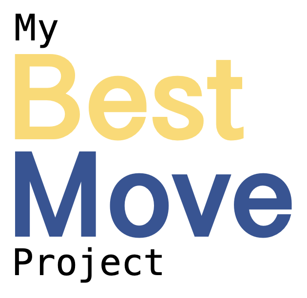

## The App

myBestMove is a web application that helps users to find the best place to live based on their preferred transportation method and travel time. It allows users to search for locations, select a transportation method, and generate isochrones, which are lines that connect all the points reachable within a certain time frame. 

Users can also upload a CSV file with a list of houses of interest, and the app will filter out all the locations that do not fall within the generated isochrones. Additionally, users can filter the list of houses by max price and minimum squared meters. 

## Installation

To use myBestMove, you will need to have a [geoAPIfy API key](https://www.geoapify.com/) and a CSV file with a list of houses of interest. Once you have these, you can clone this repository, install the required dependencies, and start the server.

```bash
> git clone https://github.com/your-username/myBestMove.git
> cd myBestMove
> pip install -r requirements.txt
> streamlit run streamlit_app.py
```

## Example

Here is an example of an isochrone generated using myBestMove:


